<div align="center">


<h1>Data Catalog Benchmark</h1>

<p><strong>The Institutional-Grade Platform for Standardized Data Catalog Foundations, Metadata Governance, and Multi-Cloud Discovery Ecosystems.</strong></p>

[]()
[]()
[]()

<br/>

> **"Industrializing data governance to automate metadata foundations."** 
> **Data Catalog Benchmark** is an enterprise-grade platform designed to provide a secure, measurable, and highly automated foundation for global data governance operations. It orchestrates the complex lifecycle of metadata—from multi-cloud harvesting and automated lineage extraction to high-throughput discovery and unified governance auditing.

</div>

---

## 🏛️ Executive Summary

Fragmented metadata silos and manual data discovery are strategic operational liabilities; lack of a standardized catalog benchmark is a primary barrier to organizational engineering maturity. Organizations fail to govern their data estates not because of a lack of catalogs, but because of fragmented metadata standards, lack of automated lineage validation, and an inability to orchestrate governance planes with operational precision.

This platform provides the **Governance Intelligence Plane**. It implements a complete **Data-Catalog-Benchmark-as-Code Framework**, enabling CDOs and Data Stewards to manage global governance foundations as first-class citizens. By automating the identification of metadata bottlenecks through real-time telemetry analysis and orchestrating the provisioning of secure performance-driven governance policies, we ensure that every organizational data asset—from raw lakehouse tables to executive gold reports—is cataloged by default, audited for history, and strictly aligned with institutional governance frameworks.

---

## 📐 Architecture Storytelling: Principal Reference Models

### 1. Principal Architecture: Global Data Catalog Benchmark & Governance Intelligence Plane
This diagram illustrates the end-to-end flow from metadata telemetry ingestion and multi-cloud orchestration to catalog enforcement, performance validation, and institutional governance auditing.

```mermaid
graph LR
    %% Subgraph Definitions
    subgraph MetadataIngress["Metadata & Lineage Ingress"]
        direction TB
        Catalogs["Azure Purview / Glue / Dataplex"]
        Engines["Snowflake / Databricks / Fabric"]
        Platforms["M365 / Salesforce / SAP"]
    end

    subgraph IntelligenceEngine["Governance Intelligence Hub"]
        direction TB
        API["FastAPI Governance Gateway"]
        CatalogOrchestrator["Global Metadata & Lineage Hub"]
        Governance_Hub["Compliance & Guardrail Hub"]
        AIOps_Validator["Drift & Discovery Analysis Hub"]
    end

    subgraph OperationsPlane["Distributed Governance Ecosystem"]
        direction TB
        ManagedCatalogs["Managed Standardized Metadata Hubs"]
        ActivePipelines["Managed Automated Lineage Pipes"]
        DiscoverySinks["Managed Infrastructure Delivery Hubs"]
    end

    subgraph OperationsHub["Institutional Data Hub"]
        direction TB
        Scorecard["Governance Maturity Scorecard"]
        Analytics["Discovery Flow & Accuracy Velocity Stats"]
        Audit["Forensic Governance Metadata Lake"]
    end

    subgraph DevOps["Data-Catalog-Benchmark-as-Code Framework"]
        direction TB
        TF["Terraform Governance Modules"]
        DriftBot["Productivity & Config Drift Validator"]
        ChatOps["Measurement Operations Hub"]
    end

    %% Flow Arrows
    MetadataIngress -->|1. Submit Telemetry| API
    API -->|2. Orchestrate Governance| CatalogOrchestrator
    CatalogOrchestrator -->|3. Apply Privacy Guard| Governance_Hub
    Governance_Hub -->|4. Assess Drift| AIOps_Validator
    
    AIOps_Validator -->|5. Execute Harvesting| OperationsPlane
    OperationsPlane -->|6. Notify Status| ChatOps
    API -->|7. Visualize Health| Scorecard
    
    Scorecard -->|8. Track Maturity| Analytics
    Scorecard -->|9. Record Performance| Audit
    
    TF -->|10. Provision Backbone| IntelligenceEngine
    DriftBot -->|11. Inject Friction Risk| CatalogOrchestrator
    Audit -->|12. Improve Operations| ManagedCatalogs

    %% Styling
    classDef ingress fill:#f5f5f5,stroke:#616161,stroke-width:2px;
    classDef intel fill:#e8eaf6,stroke:#1a237e,stroke-width:2px;
    classDef operations fill:#e1f5fe,stroke:#01579b,stroke-width:2px;
    classDef ops fill:#ede7f6,stroke:#311b92,stroke-width:2px;
    classDef devops fill:#e8f5e9,stroke:#1b5e20,stroke-width:2px;

    class MetadataIngress ingress;
    class IntelligenceEngine intel;
    class OperationsPlane operations;
    class OperationsHub ops;
    class DevOps devops;
```

### 2. The Governance Lifecycle Flow
The continuous path of a data catalog platform from initial integration (harvest) and aggregation (index) to active analysis (classify), optimization (certify), and institutional forensic auditing (scorecard).

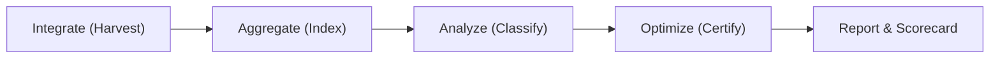

### 3. Distributed Governance Topology
Strategically orchestrating standardized governance across global data regions, diverse cloud architectures, and multi-cloud targets, providing a unified institutional view of global governance health and operational readiness.

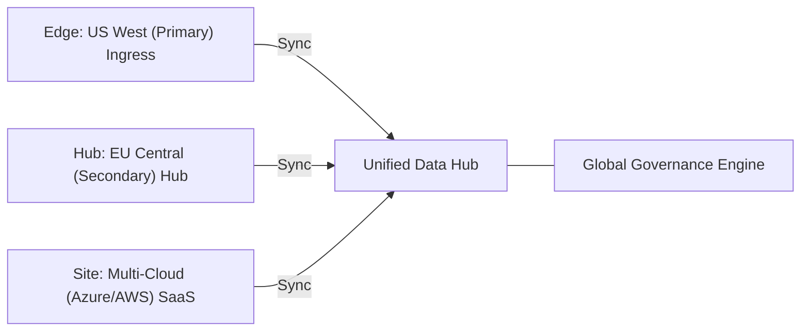

### 4. Governance Hub & High-Trust Data Plane Protection Flow
Executing complex logic for securing the bridge between data owners and consumers, ensuring every organizational identity is verified, metadata-level privacy is maintained, and every governance access is according to institutional standards.

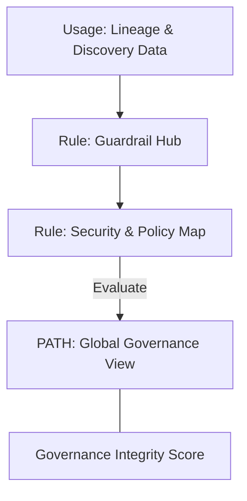

### 5. Multi-Cloud Governance Federation & Governance Flow
Automatically managing unified governance standards across global regions and diverse cloud tenants, ensuring institutional data residency and privacy boundaries by default.

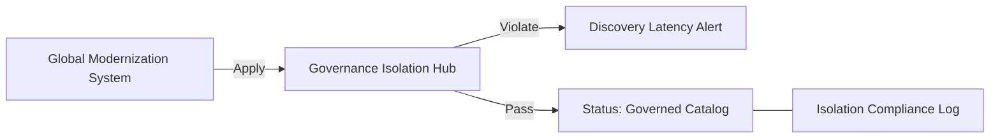

### 6. Encryption & Perimeter Protection Flow (Governance Standard)
Managing the lifecycle of a governance request, automatically enforcing institutional TLS 1.3 and resource encryption standards as required by security policy, ensuring zero-latency security confidence.

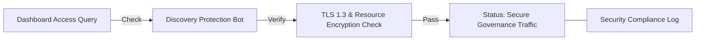

### 7. Institutional Governance Maturity Scorecard
Grading organizational performance based on key indicators: Metadata Coverage Index, Lineage Fidelity Index, and Discovery Adoption Scores.

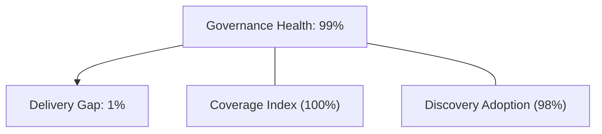

### 8. Identity & RBAC for Governance
Managing fine-grained access to governance hubs, provisioning workers, and audit logs between CDOs, Data Stewards, and Analysts.

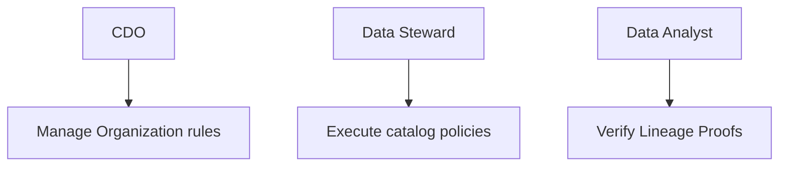

### 9. IaC Deployment: Data-Catalog-Benchmark-as-Code Framework
Using modular Terraform to deploy and manage the versioned distribution of the governance tracking hubs, indexing protection workers, and forensic metadata lakes.

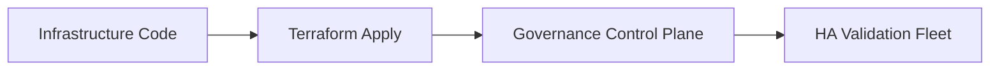

### 10. AIOps Governance Drift & Risk Validation Flow
Using advanced analytics to identify sudden surges in discovery latency, unauthorized metadata changes, suspicious configuration drifts, or unusual delivery pattern changes that could result in institutional risk or data loss.

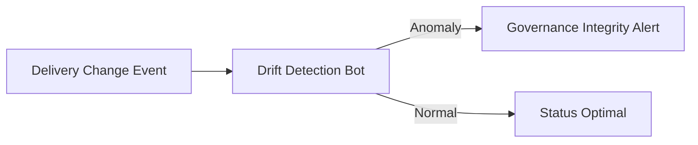

### 11. Metadata Lake for Forensic Governance Audit
Storing long-term records of every metadata integration event (metadata), every harvest executed, and every version history for institutional record-keeping, compliance auditing, and post-provisioning forensics.

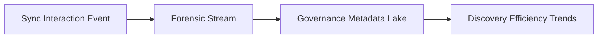

---

## 🏛️ Core Governance Pillars

1.  **Unified Foundation Coordination**: Maximizing resilience by centralizing all governance measurement through a single institutional plane.
2.  **Automated Metadata Provisioning**: Eliminating "manual indexing" scenarios through proactive orchestration and pattern verification.
3.  **Sequential Lineage Intelligence**: Ensuring zero-interruption operations through dependency-aware lineage-driven data engineering.
4.  **Zero-Trust Identity Protection**: Automatically enforcing identity-based access, team-level aggregation, and privacy evaluation across all discovery tiers.
5.  **Autonomous Operations Logic**: Guaranteeing reliability through automated industry-specific effectiveness monitoring runbooks.
6.  **Full Discovery Auditability**: Immutable recording of every metadata change and discovery provision for institutional forensics.

---

## 🛠️ Technical Stack & Implementation

### Governance Engine & APIs
*   **Framework**: Python 3.11+ / FastAPI.
*   **Performance Engine**: Custom Python-based logic for multi-toolchain harvesting and DORA-style discovery metrics.
*   **Integrations**: Native connectors for Azure Purview, Glue, Dataplex, Snowflake, and Unity Catalog.
*   **Persistence**: PostgreSQL (Governance Ledger) and Redis (Live Indexing State).
*   **Auth Orchestrator**: Federated OIDC/SAML for least-privilege governance management access.

### Governance Dashboard (UI)
*   **Framework**: React 18 / Vite.
*   **Theme**: Dark, Slate, Indigo (Modern high-fidelity productivity aesthetic).
*   **Visualization**: D3.js for delivery topologies and Recharts for discovery velocity analytics.

### Infrastructure & DevOps
*   **Runtime**: AWS EKS or Azure Kubernetes Service (AKS) for management plane.
*   **Measurement Hub**: Managed event sourcing for immutable productivity timeline reconstruction.
*   **IaC**: Modular Terraform for deploying the governance landing zone and validation fleet.

---

## 🏗️ IaC Mapping (Module Structure)

| Module | Purpose | Real Services |
| :--- | :--- | :--- |
| **`infrastructure/governance_hub`** | Central management plane | EKS, PostgreSQL, Redis |
| **`infrastructure/enforcers`** | Distributed discovery provisioners | Azure, AWS, GCP APIs |
| **`infrastructure/harvest_pipes`** | Data Ingestion Hubs | Webhooks, Lambda |
| **`infrastructure/auditing`** | Forensic modernization sinks | S3, Athena, Quicksight |

---

## 🚀 Deployment Guide

### Local Principal Environment
```bash
# Clone the Data Catalog Benchmark repository
git clone https://github.com/devopstrio/data-catalog-benchmark.git
cd data-catalog-benchmark

# Configure environment
cp .env.example .env

# Launch the Governance stack
make init

# Trigger a mock discovery update and automated guardrail validation simulation
make simulate-benchmark
```

Access the Management Portal at `http://localhost:3000`.

---

## 📜 License
Distributed under the MIT License. See `LICENSE` for more information.

---
<div align="center">
  <p>© 2026 Devopstrio. All rights reserved.</p>
</div>
