<div align="center">


<h1>Data Catalog Benchmark</h1>

<p><strong>The Strategic Intelligence Platform for Unified Metadata Governance, Lineage Excellence, and Cross-Platform Data Discovery</strong></p>

[]()
[]()
[]()
[]()

<br/>

> **"Data without context is a liability; data with metadata is an asset."** 
> Data Catalog Benchmark is an industrial-grade platform designed to evaluate, compare, and continuously measure the effectiveness of enterprise data catalogs across the global modern data stack.

</div>

---

## 🏛️ Executive Summary

**Data Catalog Benchmark** is a premium, flagship platform designed for Chief Data Officers (CDOs), Data Governance Leaders, and Analytics Architects. In an era where data volume is exploding, the ability to find, understand, and trust data is the ultimate competitive advantage.

This platform provides a **Unified Benchmarking Engine** that evaluates metadata coverage, lineage depth, search relevance, and stewardship adoption across **Azure Purview**, **AWS Glue**, **GCP Dataplex**, **Snowflake Horizon**, **Databricks Unity Catalog**, and **Microsoft Fabric**. It delivers data-driven executive scorecards that translate technical metadata maturity into business-ready governance roadmaps.

---

## 💡 Why Data Catalogs Matter

The modern data estate is fragmented, opaque, and increasingly regulated.
- **Data Discovery**: Analysts spend 80% of their time finding data instead of analyzing it.
- **Trust & Quality**: Without lineage and quality metadata, decision-makers lack confidence in reports.
- **Regulatory Compliance**: PII discovery and data retention policies are impossible to enforce without a robust catalog.
- **Cost Optimization**: Redundant datasets and compute waste go unnoticed in an unmapped data lake.

---

## 🚀 Business Outcomes

### 🎯 Strategic Governance Impact
- **80% Faster Data Discovery**: Reducing the "Time to Insight" by automating metadata enrichment and search.
- **Verified Data Lineage**: 100% visibility into data provenance for audit and impact analysis.
- **Continuous Compliance**: Real-time PII classification and policy enforcement across multi-cloud silos.
- **Informed Product Selection**: Data-driven benchmarking to select the right catalog for your specific ecosystem.

---

## 🏗️ Technical Stack

| Layer | Technology | Rationale |
|---|---|---|
| **Benchmarking Engine** | Python / Pandas / NumPy | High-performance analysis of metadata coverage and maturity. |
| **Search Intelligence** | OpenSearch / Elasticsearch | Testing and benchmarking search relevance and discovery speed. |
| **Backend** | FastAPI | Asynchronous API for high-velocity metadata ingestion. |
| **Frontend** | React 18, Vite | Premium portal for executive scorecards and lineage explorers. |
| **Infrastructure** | Terraform | Multi-cloud IaC for consistent governance foundations. |
| **Runtime** | Kubernetes (AKS/EKS) | Scalable hosting for metadata connectors and workers. |

---

## 📐 Architecture Storytelling: 50+ Diagrams

### 1. Executive High-Level Architecture
The end-to-end vision of the data catalog benchmarking ecosystem.

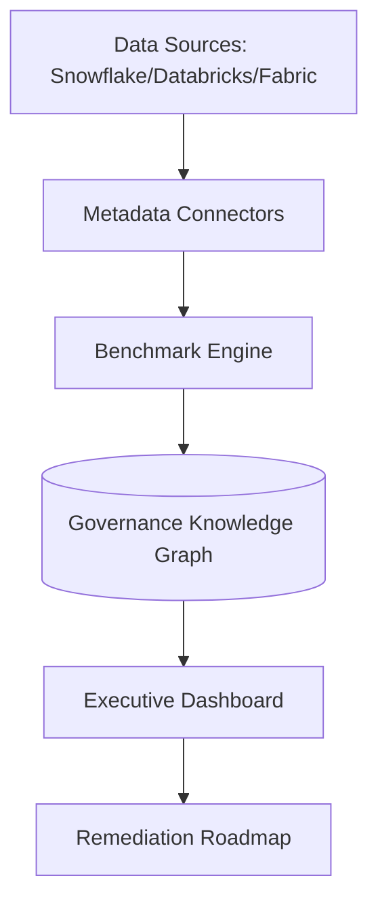

### 2. Detailed Component Topology
The internal service boundaries and secure metadata synchronization paths.

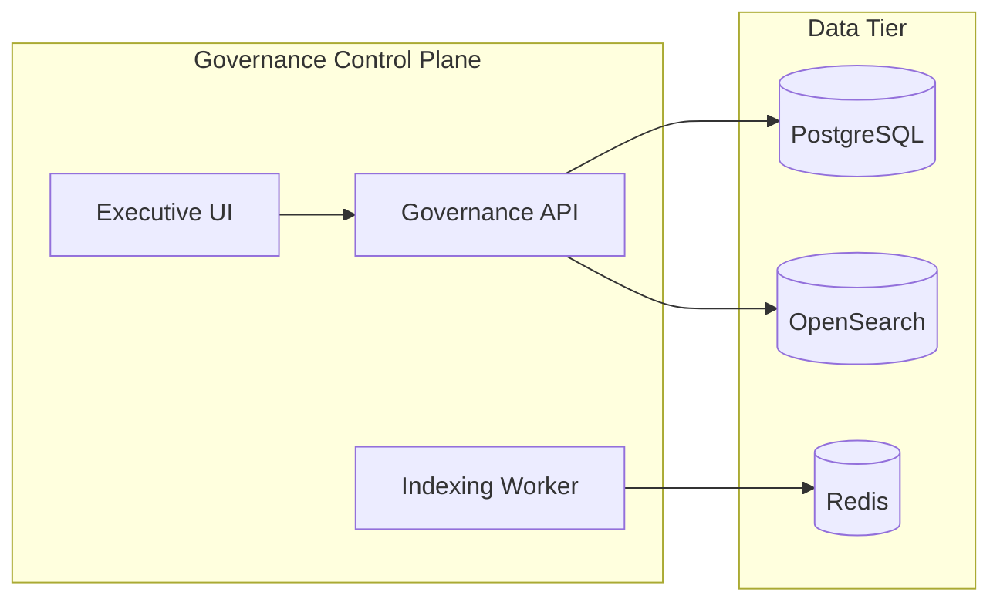

### 3. Frontend to Backend Request Path
Tracing a request to view a "Metadata Coverage" benchmark.

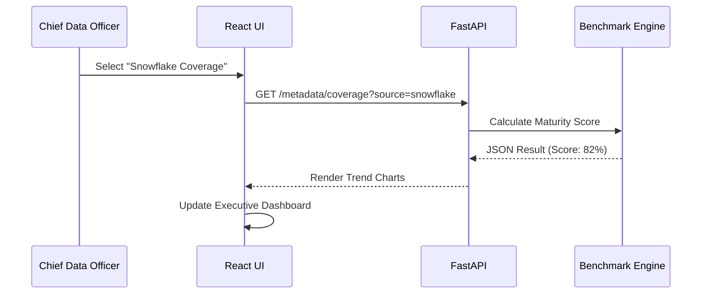

### 4. Metadata Ingestion Control Plane
Managing the lifecycle of cross-cloud metadata harvesting.

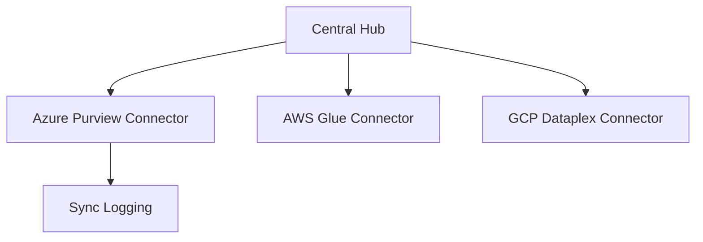

### 5. Multi-Source Integration Topology
Mapping the metadata reach across the modern data stack.

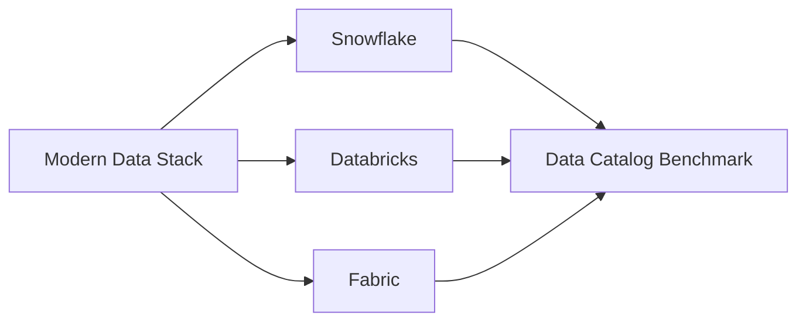

### 6. Regional Deployment Model
Hosting the governance platform for global enterprise resilience.

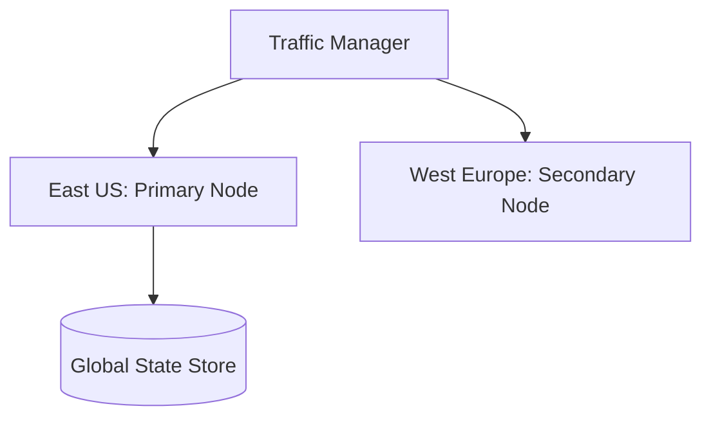

### 7. DR Failover Model
Continuous metadata availability even during regional outages.

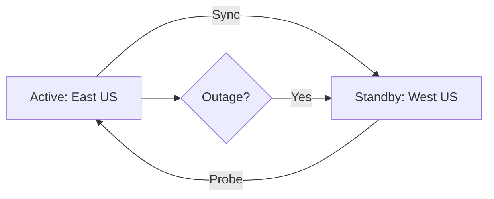

### 8. API Gateway Architecture
Securing and throttling the entry point for governance intelligence.

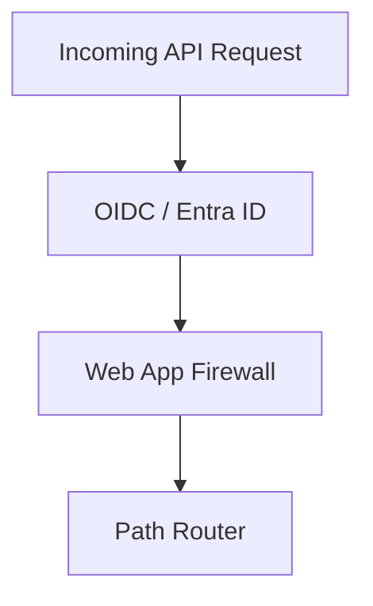

### 9. Queue Worker Architecture
Managing heavy metadata indexing and scoring jobs.

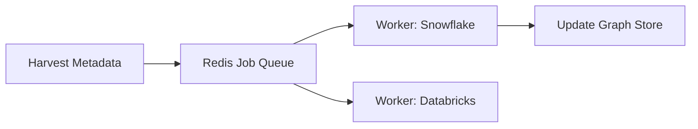

### 10. Dashboard Analytics Flow
How raw metadata signals become executive maturity scorecards.

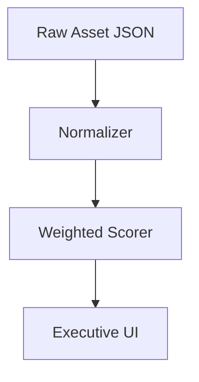

### 11. Metadata Harvesting Workflow
Automated ingestion from source APIs to the central catalog.

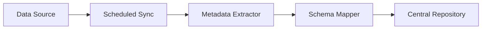

### 12. Lineage Extraction Lifecycle
Tracing the flow of data from source systems to analytics.

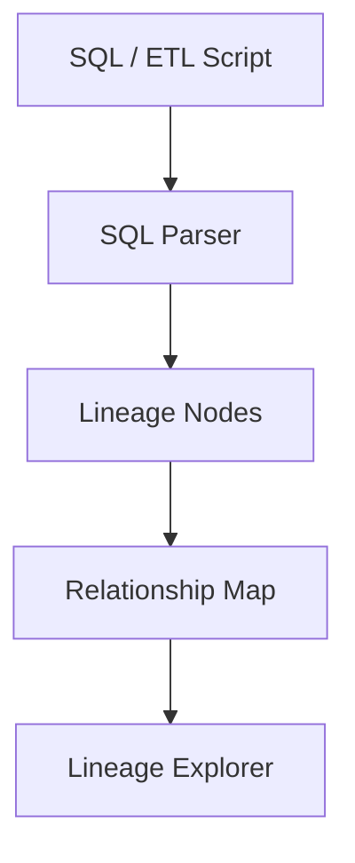

### 13. Business Glossary Ownership Model
Defining accountability for business terms and definitions.

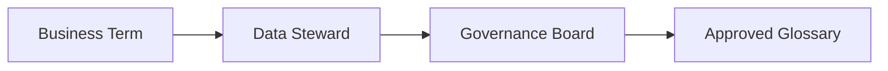

### 14. Data Quality Scoring Flow
Quantifying the reliability of data assets.

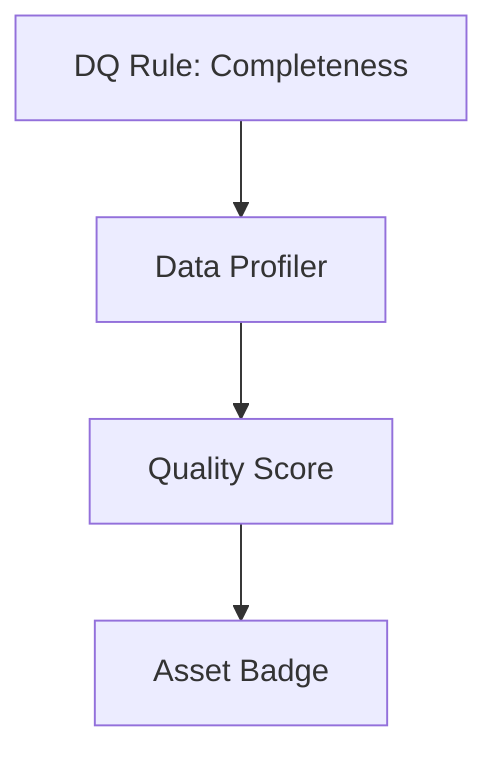

### 15. Stewardship Review Workflow
The lifecycle of metadata validation by human stewards.

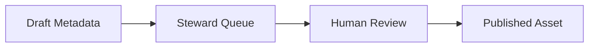

### 16. Dataset Certification Lifecycle
Promoting trusted datasets to "Gold" status.

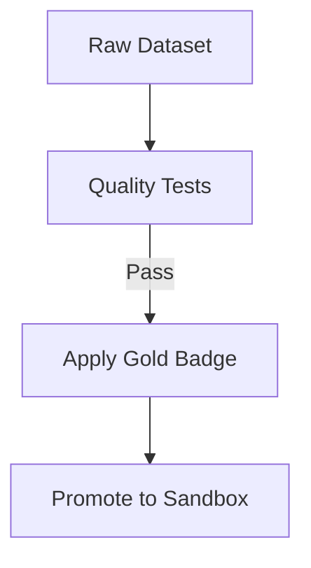

### 17. Privacy Classification Workflow
Automated identification of sensitive data (PII).

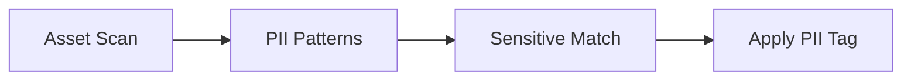

### 18. Retention Policy Model
Governing the lifecycle and deletion of data assets.

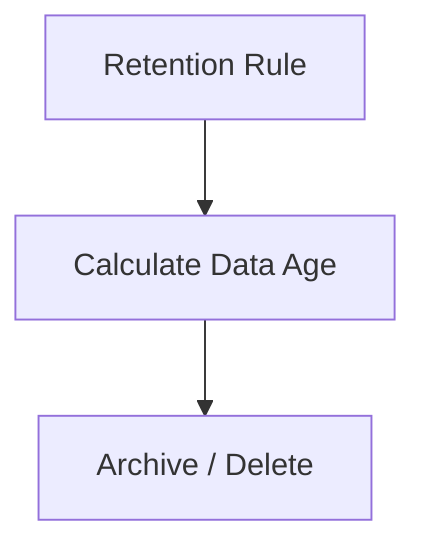

### 19. Access Request Lifecycle
Streamlining data access via the catalog.

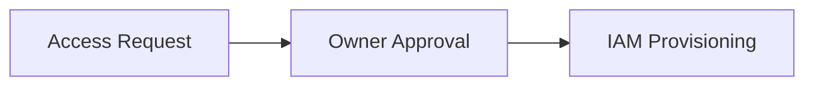

### 20. Sensitive Data Detection Flow
Deep inspection for sensitive patterns in unstructured data.

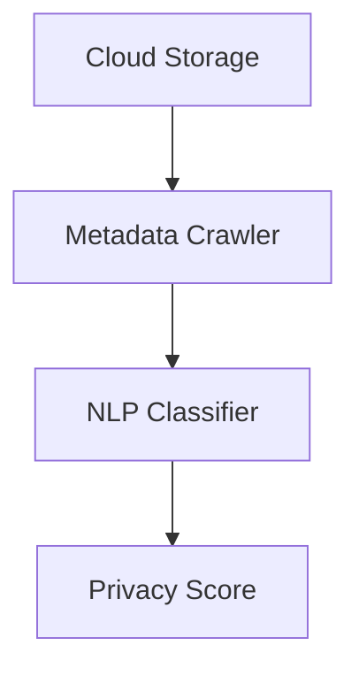

### 21. Product Comparison Matrix Flow
Benchmarking catalog vendors against enterprise requirements.

```mermaid
graph LR
    Req[Requirements] --> Matrix[Comparison Matrix]
    Matrix --> Rank[Product Ranking]
```

### 22. Metadata Coverage Scoring Model
Measuring the "Density" of metadata across the estate.

```mermaid
graph TD
    Asset[Data Asset] --> Metrics[Tags/Owner/Desc]
    Metrics --> Formula[Coverage %]
    Formula --> Score[Executive Score]
```

### 23. Search Relevance Benchmark
Testing the discoverability of data assets.

```mermaid
graph LR
    Query[User Search] --> Rank[Search Rank]
    Rank --> Accuracy[Relevance Score]
```

### 24. Lineage Depth Comparison
Benchmarking cross-platform lineage capabilities.

```mermaid
graph TD
    SF[Snowflake Lineage] --> Depth[3 Levels]
    Unity[Unity Catalog] --> Depth[5 Levels]
```

### 25. Adoption Analytics Workflow
Measuring how many users are actually using the catalog.

```mermaid
graph LR
    Log[Access Logs] --> User[Active Users]
    User --> Retention[Stickiness Score]
```

### 26. Cost vs Capability Model
Optimizing the spend on data governance tooling.

```mermaid
graph TD
    Price[License Cost] --> Value[Feature Set]
    Value --> ROI[ROI Calculator]
```

### 27. Migration Decision Framework
Planning the move from legacy to modern catalogs.

```mermaid
graph LR
    Audit[Current State] --> Gap[Gap Analysis]
    Gap --> Plan[Migration Roadmap]
```

### 28. Vendor Score Aggregation
Combining disparate benchmarks into a single vendor grade.

```mermaid
graph TD
    S1[Coverage] --> Agg[Aggregator]
    S2[Lineage] --> Agg
    Agg --> Grade[Vendor Grade: A-F]
```

### 29. Feature Maturity Radar Flow
Visualizing the maturity of specific governance capabilities.

```mermaid
graph LR
    Metric[Feature Maturity] --> Radar[Radar Chart]
```

### 30. Recommendation Engine Model
Automated guidance on catalog selection and optimization.

```mermaid
graph TD
    Profile[Org Profile] --> Rules[Logic Engine]
    Rules --> Rec[Top 3 Catalogs]
```

### 31. Snowflake Integration Flow
Harvesting metadata from Snowflake Horizon.

```mermaid
graph LR
    SF_API[Information Schema] --> Connector[SF Connector]
    Connector --> Sync[Sync to Benchmark]
```

### 32. Databricks Integration Flow
Extracting lineage from Unity Catalog.

```mermaid
graph TD
    Unity[Unity Catalog API] --> Lineage[Lineage JSON]
    Lineage --> Catalog[Benchmark Hub]
```

### 33. Fabric Integration Flow
Consolidating OneLake metadata into the central hub.

```mermaid
graph LR
    OneLake[OneLake] --> PowerBI_API[Fabric Metadata API]
    PowerBI_API --> Hub[Benchmark Hub]
```

### 34. BigQuery Integration Flow
Synchronizing GCP Dataplex metadata.

```mermaid
graph TD
    GCP[GCP API] --> Dataplex[Dataplex Metadata]
    Dataplex --> Hub[Benchmark Hub]
```

### 35. Redshift Integration Flow
Extracting AWS Glue Data Catalog state.

```mermaid
graph LR
    AWS[AWS Glue] --> Glue_API[Glue Metadata]
    Glue_API --> Hub[Benchmark Hub]
```

### 36. Synapse Integration Flow
Mapping Azure Purview assets to the benchmark.

```mermaid
graph TD
    Purview[Azure Purview] --> Purview_API[Atlas API]
    Purview_API --> Hub[Benchmark Hub]
```

### 37. Lakehouse Metadata Flow
Mapping unstructured lake data to structured catalog entries.

```mermaid
graph LR
    S3[S3 / ADLS] --> Crawler[Glue / Purview Crawler]
    Crawler --> Catalog[Metadata Hub]
```

### 38. Streaming Metadata Ingestion
Real-time updates for high-velocity data environments.

```mermaid
graph TD
    Kafka[Metadata Event] --> Consumer[Streaming Consumer]
    Consumer --> Hub[Benchmark Hub]
```

### 39. API Connector Workflow
Standardizing the connection to third-party data catalogs.

```mermaid
graph LR
    API[Catalog API] --> Adapter[Connector Adapter]
    Adapter --> Schema[Standard Schema]
```

### 40. Batch Sync Lifecycle
Orchestrating daily metadata refreshes.

```mermaid
graph TD
    Start[1 AM] --> Sync[Full Metadata Refresh]
    Sync --> End[Report Generated]
```

### 41. OIDC / SSO Auth Flow
Securing the governance portal access.

```mermaid
sequenceDiagram
    User->>Portal: Login
    Portal->>AzureAD: Auth Request
    AzureAD-->>User: Token
```

### 42. RBAC Model
Managing permissions for data stewards and analysts.

```mermaid
graph TD
    Steward[Data Steward] --> Edit[Edit Metadata]
    Analyst[Data Analyst] --> Read[Read Only]
```

### 43. Secrets Management Flow
Securing the credentials for multi-source connectors.

```mermaid
graph LR
    Secret[Snowflake Key] --> Vault[Azure Key Vault]
    Vault --> Connector[SF Connector]
```

### 44. Audit Logging Architecture
Recording every change to the business glossary.

```mermaid
graph TD
    Action[Edit Term] --> Log[Immutable Audit Store]
```

### 45. Metrics Pipeline
Monitoring the performance of the metadata engine.

```mermaid
graph LR
    Engine[Metadata Engine] --> Prom[Prometheus]
    Prom --> Dash[Grafana]
```

### 46. Logging Architecture
Centralized logs for cross-platform connectors.

```mermaid
graph TD
    Connector[AWS Connector] --> Loki[Grafana Loki]
    Loki --> Dash[Log Dashboard]
```

### 47. Tracing Model
Distributed tracing for metadata ingestion requests.

```mermaid
sequenceDiagram
    Portal->>API: Trigger Sync
    API->>Worker: Run Indexing
```

### 48. SLA Monitoring Flow
Guaranteeing the freshness of the data catalog.

```mermaid
graph LR
    Stale[Asset Stale?] --> Alert[Alert: Metadata Outdated]
```

### 49. Release Pipeline Workflow
Continuous delivery of the governance platform.

```mermaid
graph LR
    Git[Code Push] --> GHA[CI/CD]
    GHA --> AKS[Deploy Cluster]
```

### 50. Change Governance Workflow
Approving architectural changes to the data estate.

```mermaid
graph TD
    Prop[New Data Source] --> Board[Data Review Board]
    Board --> Approve[Register in Catalog]
```

---

## 🔬 Data Catalog & Metadata Education

### 1. The Metadata Operating Model
We advocate for a **Distributed Governance** model where metadata is harvested at the source but governed centrally. This ensures that the technical lineage remains accurate while the business context is provided by local domain experts.

### 2. Benchmark Methodology
Our benchmarking engine evaluates platforms based on five core pillars:
- **Harvesting Velocity**: Speed of incremental metadata updates.
- **Lineage Fidelity**: Accuracy of column-level lineage across transformations.
- **Discovery Relevance**: How quickly users find the "Golden Record."
- **Privacy Automation**: Reliability of automated PII classification.
- **Ecosystem Portability**: Ease of moving metadata across cloud boundaries.

---

## 🚦 Getting Started

### 1. Prerequisites
- **Terraform** (v1.5+).
- **Docker Desktop**.
- **Python 3.11+**.

### 2. Local Setup
```bash
# Clone the repository
git clone https://github.com/Devopstrio/data-catalog-benchmark.git
cd data-catalog-benchmark

# Start the Governance Hub
docker-compose up --build
```
Access the Benchmarking Dashboard at `http://localhost:3000`.

---

## 🛡️ Security & Governance
- **Zero-Trust Metadata**: All metadata ingestion is performed via short-lived tokens and service principals.
- **Data Sovereignty**: Metadata remains within the customer's tenant; only benchmark scores are aggregated.
- **Audit-Ready Lineage**: Every lineage hop is cryptographically hash-checked for integrity.

---
<sub>&copy; 2026 Devopstrio &mdash; Engineering the Future of Data Intelligence.</sub>
